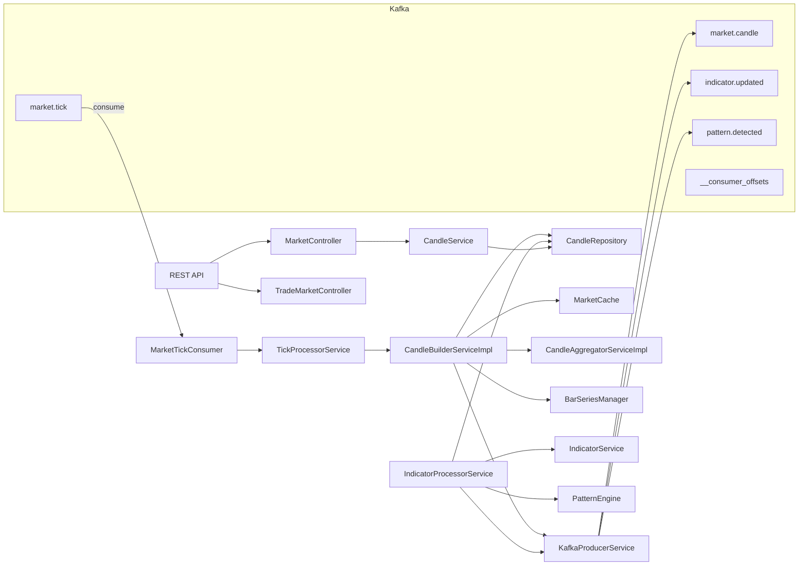

                                    ┌────────────────────┐
                                    │   Broker Service   │
                                    └─────────┬──────────┘
                                              │
                                              │ market.tick
                                              ▼
                              ┌───────────────────────────┐
                              │       Kafka Cluster       │
                              │      market.tick Topic    │
                              └────────────┬──────────────┘
                                           │
                                           ▼
                              ┌───────────────────────────┐
                              │   MarketTickConsumer      │
                              └────────────┬──────────────┘
                                           │
                                           ▼
                              ┌───────────────────────────┐
                              │ TickProcessorService      │
                              │ • Validate Symbol         │
                              │ • Update Latest Price     │
                              └───────┬─────────┬─────────┘
                                      │         │
                                      │         │
                                      ▼         ▼
                           ┌──────────────┐  ┌────────────────────┐
                           │ Market Cache │  │ CandleBuilderService│
                           └──────────────┘  └─────────┬───────────┘
                                                       │
               ┌───────────────────────────────────────┼─────────────────────────────────────┐
               │                                       │                                     │
               ▼                                       ▼                                     ▼
      ┌─────────────────┐                 ┌──────────────────────┐              ┌───────────────────┐
      │ Active Candle   │                 │ CandleRepository     │              │ BarSeriesManager  │
      │ Memory Map      │                 │ (MySQL)              │              │ TA4J              │
      └─────────────────┘                 └──────────────────────┘              └───────────────────┘
                                                       │
                                                       ▼
                                     ┌──────────────────────────────┐
                                     │ CandleAggregatorService      │
                                     │                              │
                                     │ 1m → 5m                      │
                                     │ 1m → 15m                     │
                                     │ 1m → 30m                     │
                                     │ 1m → 1H                      │
                                     │ 1m → Daily                   │
                                     └──────────────┬───────────────┘
                                                    │
                                                    ▼
                                         ┌───────────────────────┐
                                         │ KafkaProducerService  │
                                         └───────┬───────┬───────┘
                                                 │       │
                                                 │       │
                                                 ▼       ▼
                                  market.candle      indicator.updated
                                                         │
                                                         ▼
                                                pattern.detected

────────────────────────────────────────────────────────────────────────────

                Every 60 Seconds (Spring Scheduler)

                         ┌────────────────────────┐
                         │ IndicatorProcessor     │
                         └───────────┬────────────┘
                                     │
                  ┌──────────────────┼──────────────────┐
                  │                  │                  │
                  ▼                  ▼                  ▼
         CandleRepository     BarSeriesManager    IndicatorService
                                                      │
                                                      │
                     EMA • RSI • MACD • VWAP • BBands • ATR • ADX
                                                      │
                                                      ▼
                                              Pattern Engine
                                                      │
                                                      ▼
                                           KafkaProducerService
                                                      │
                                 indicator.updated / pattern.detected

# Trade Market Service Flow

## Purpose
`trade-market-service` ingests market tick events, builds candles, computes indicators, publishes Kafka events, and exposes market data via REST.

## Kafka topics
- `market.tick` — incoming tick events consumed by this service
- `market.candle` — candle events published after a 1-minute candle is finalized
- `indicator.updated` — published after indicator calculation completes
- `pattern.detected` — published when pattern detection finds a pattern
- `__consumer_offsets` — Kafka internal consumer offsets topic (not directly used by business logic)

## Components

### 1. Consumer: MarketTickConsumer
- File: `src/main/java/com/trade/market/kafka/MarketTickConsumer.java`
- Functionality:
  - Listens to `market.tick` topic
  - Receives `TickDto`
  - Forwards the tick to `TickProcessorService.processTick()`
  - Logs errors if tick processing fails

### 2. Tick validation and routing: TickProcessorService
- File: `src/main/java/com/trade/market/service/TickProcessorService.java`
- Functionality:
  - Validates that tick symbol exists and is non-empty
  - Updates latest price cache via `MarketCacheService`
  - Delegates tick to `CandleBuilderService.processTick()`

### 3. Candle building: CandleBuilderServiceImpl
- File: `src/main/java/com/trade/market/service/impl/CandleBuilderServiceImpl.java`
- Functionality:
  - Receives valid ticks and groups them into 1-minute candles
  - If the tick belongs to the current candle interval, updates high/low/close/volume
  - When the minute boundary moves, finalizes the prior candle:
    - Saves it to `CandleRepository`
    - Updates `MarketCache` with the current candle
    - Adds the candle to TA4J series via `BarSeriesManager`
    - Calls `CandleAggregatorService.aggregateCandles()`
    - Publishes the finalized candle via `KafkaProducerService.publishCandle()`
  - Keeps an in-memory map of active candles per symbol
  - Uses candle start time rounded to the minute boundary

### 4. Aggregation: CandleAggregatorServiceImpl
- File: `src/main/java/com/trade/market/service/impl/CandleAggregatorServiceImpl.java`
- Functionality:
  - Creates higher-timeframe candles from 1-minute candles:
    - 5-minute candles
    - 15-minute candles
    - 30-minute candles
    - 1-hour candles
    - daily candles
  - For each aggregation level, it:
    - rounds the 1-minute candle start time down to the timeframe boundary
    - loads 1-minute candles in that interval
    - if enough candles exist, builds an aggregated candle and saves it
  - Aggregated candle fields:
    - open = first candle open
    - high = max high
    - low = min low
    - close = last candle close
    - volume = sum of volumes

### 5. TA4J series management: BarSeriesManager
- File: `src/main/java/com/trade/market/indicator/BarSeriesManager.java`
- Functionality:
  - Maintains an in-memory `BarSeries` per `symbol:timeframe`
  - Converts `Candle` into a TA4J `BaseBar` using `DecimalNum`
  - Uses a per-series `ReentrantLock` to serialize concurrent series updates
  - Enforces strict chronological order: bars are only added if their end time is after the last bar's end time
  - Skips duplicate or stale candles to avoid TA4J `end time <= series end time` errors
  - Safely ignores `IllegalArgumentException` from `series.addBar()` when concurrent or duplicate adds happen

### 6. Scheduled indicator processing: IndicatorProcessorService
- File: `src/main/java/com/trade/market/service/impl/IndicatorProcessorService.java`
- Functionality:
  - Runs on a schedule: `@Scheduled(fixedDelayString = "${market.scheduler.indicator-delay-ms:60000}")`
  - Loads distinct symbols from the candle repository via `findDistinctSymbols()`
  - For each symbol:
    - loads latest 500 `ONE_MINUTE` candles ordered by descending start time
    - extracts close prices from those candles
    - initializes the TA4J series oldest->newest if missing
    - calculates indicators using `IndicatorService`
    - persists indicator results
    - publishes `indicator.updated` via Kafka
    - adds the most recent candle to the TA4J series
    - detects chart patterns and publishes `pattern.detected` if any

### 7. Kafka publisher: KafkaProducerService
- File: `src/main/java/com/trade/market/kafka/KafkaProducerService.java`
- Functionality:
  - Publishes finalized candles to topic `market.candle`
  - Publishes calculated indicators to topic `indicator.updated`
  - Publishes patterns to topic `pattern.detected`
  - Logs each publish action

### 8. REST Controllers
- `MarketController`
  - File: `src/main/java/com/trade/market/controller/MarketController.java`
  - Endpoints:
    - `GET /market/latest?symbol=...` → latest price from cache
    - `GET /market/candles?symbol=...&timeframe=...&limit=...` → candle history
    - `GET /market/indicator?symbol=...&timeframe=...` → calculate indicators on demand
- `TradeMarketController`
  - File: `src/main/java/com/trade/market/controller/TradeMarketController.java`
  - Endpoint:
    - `GET /market/health` → service health response

## Calculation logic

### Candle creation logic
- `CandleBuilderServiceImpl.processTick(tick)`:
  - If no current candle exists for symbol, start a new 1-minute candle at the tick minute boundary
  - If tick is within current candle minute:
    - `high = max(current.high, tick.price)`
    - `low = min(current.low, tick.price)`
    - `close = tick.price`
    - `volume += tick.volume`
  - If tick moves to a new minute:
    - finalize and persist the current candle
    - create a new candle from the tick

### TA4J conversion
- `BarSeriesManager.addCandle(symbol, timeframe, candle)`:
  - Converts candle fields into a `BaseBar` with `Duration.ofMinutes(1)`
  - Uses `DecimalNum.valueOf(...)` for all numeric fields
  - Only adds if candle end time is strictly after last bar's end time

### Indicator calculation logic
- `IndicatorService.calculateIndicators(symbol, timeframe, closePrices)` computes:
  - **EMA20, EMA50, EMA200** via TA4J `EMAIndicator`
  - **RSI14** via TA4J `RSIIndicator`
  - **MACD** via TA4J `MACDIndicator`
  - **Signal** via TA4J `EMAIndicator` on the MACD line
  - **Histogram** via TA4J `DifferenceIndicator` between MACD and signal
  - **VWAP** via TA4J `VWAPIndicator`
  - **Bollinger Bands** via TA4J `BollingerBandsMiddleIndicator`, `BollingerBandsUpperIndicator`, and `BollingerBandsLowerIndicator`
  - **ATR** is still a placeholder value in the current implementation
  - **ADX** is still a placeholder value in the current implementation
  - **Supertrend** is currently populated from the latest close as a temporary placeholder
  - **Pivot** = latest close price
  - **Support/Resistance** based on `highLowRange(closePrices)`

- When a TA4J `BarSeries` is unavailable, the service falls back to returning latest close values for most indicators and zero for the not-yet-implemented ones.

### Pattern detection logic
- `PatternEngine.detectPattern(symbol, closePrices)` returns:
  - `DOUBLE_TOP` when latest close is above prior close and the prior close is below its neighbor
  - `DOUBLE_BOTTOM` when latest close is below prior close and prior close is above its neighbor
  - `HEAD_AND_SHOULDERS` when latest close is lower than price 2 bars earlier and prior close is higher than that price
  - `TRIANGLE` when latest two closes differ by less than 0.2
  - `NONE` otherwise

## Data flow summary

## Notes
- `__consumer_offsets` is Kafka internal bookkeeping and not part of business logic.
- `indicator.updated`, `market.candle`, and `pattern.detected` are business output topics.
- If the same candle is added more than once, `BarSeriesManager` skips it based on end-time comparison.
- `IndicatorProcessorService` uses the latest 500 candles for indicator computation.

## Usage
- To inspect the latest price: `GET /market/latest?symbol=XYZ`
- To inspect candles: `GET /market/candles?symbol=XYZ&timeframe=ONE_MINUTE&limit=100`
- To inspect indicators: `GET /market/indicator?symbol=XYZ&timeframe=ONE_MINUTE`

## Recommendation
- Replace `candleRepository.findAll()` symbol extraction in `IndicatorProcessorService` with a distinct-symbol query for better performance.
- Ensure the scheduler and tick consumer do not re-add duplicate bars in conflicting order.

